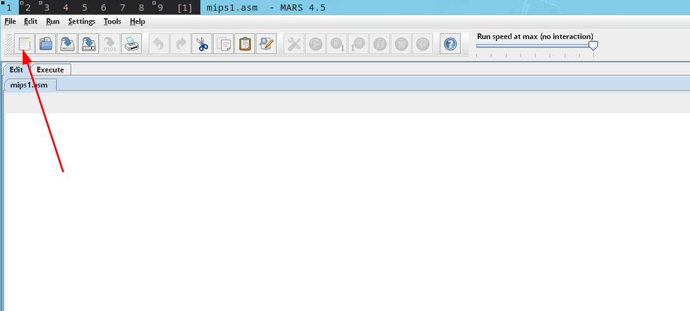
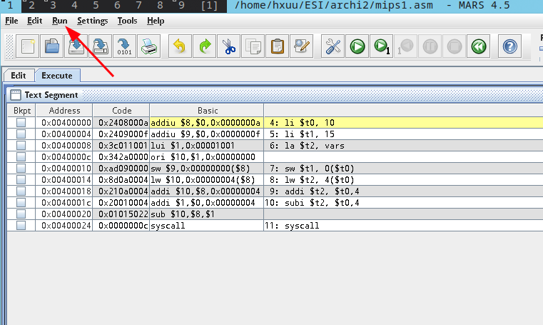
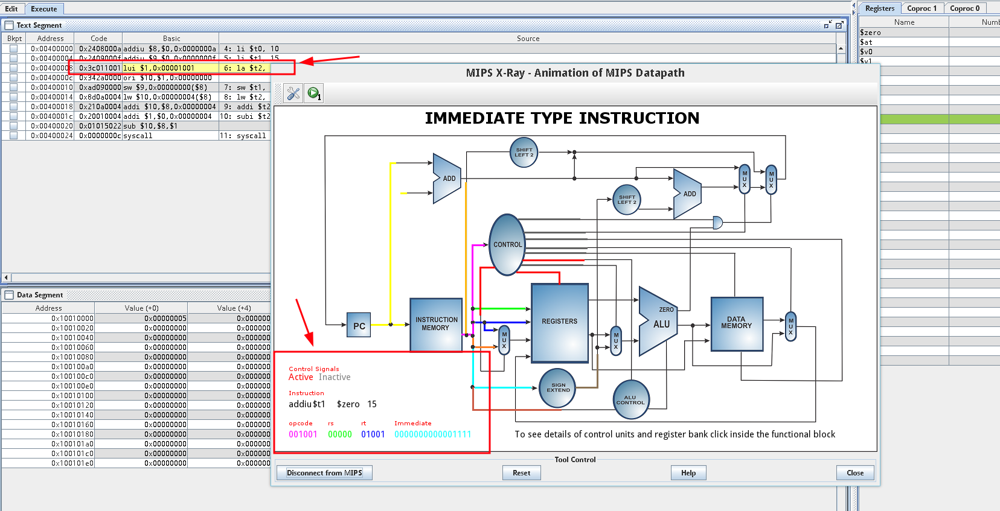
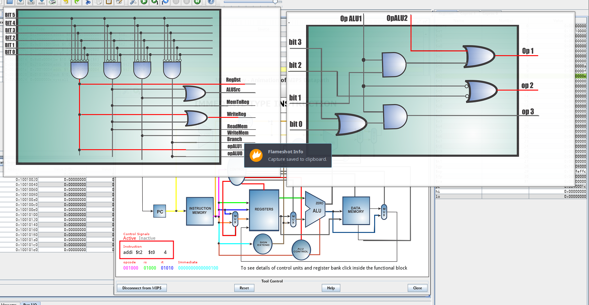
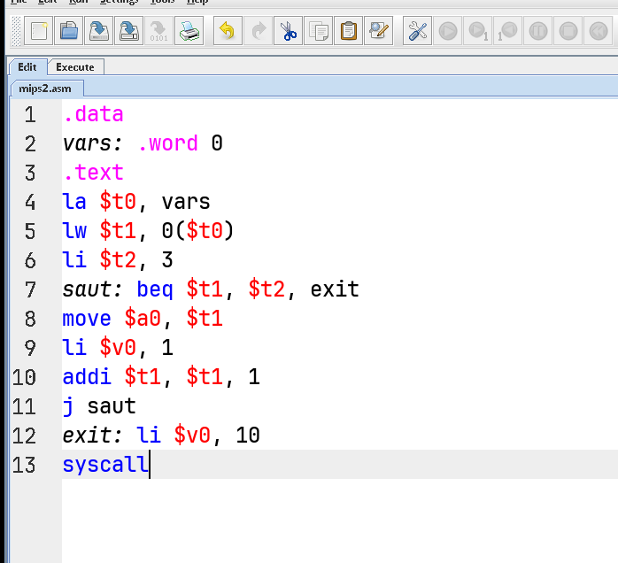
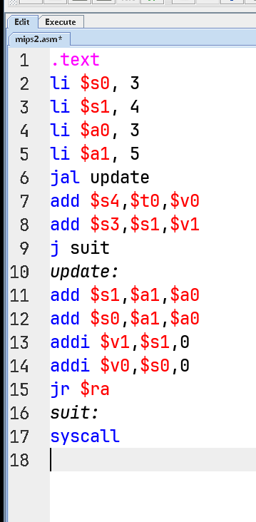

# TP Archi 2

## Steps to solve the TP

### Example 01

1. create a new file and save it using ctrl+s



2. copy the code from example 1 in the pdf

```asm
.data
vars:   .word 5
     .text
li $t0, 10
li $t1, 15
la $t2, vars
sw $t1, 0($t0)
lw $t2, 4($t0)
addi $t2, $t0,4
subi $t2, $t0,4
syscall
```

3. Donner le code  binaire de chaque instruction et le groupe de format. (press F3)



4. Pour vérifier (the way of the bits) ouvrir la fenêtre MIPS X-RAY avec Tools>mips X-RAY.



5. Donner l’état des signaux de l’unité de contrôle et du alu-contrôle pour les instructions addi et subi

addi:

sub:


### Example 02

#### `Big idea`

Writing a MIPS assembly program using MARS, a simulator that lets you run MIPS assembly instructions.

This example is about:

1. Understanding a loop.
2. Conditionally breaking out of it.
3. Watching the flow of control (ie, PC - program counter)

---

1. create a new file and save it using ctrl+s



2. copy the code from example 2 in the pdf

```asm
.data
vars: .word 0       # Declare a word (int) in memory initialized to 0

.text
la $t0, vars        # $t0 ← address of 'vars'
lw $t1, 0($t0)      # $t1 ← value at address in $t0 (initially 0)
li $t2, 3           # $t2 ← 3 (this is our loop exit condition)

saut: beq $t1, $t2, exit   # If $t1 == 3, jump to exit
move $a0, $t1              # Put $t1 into $a0 (to prepare for print)
li $v0, 1                  # Load system call code for print_int
syscall                   # Print the value in $a0
addi $t1, $t1, 1           # $t1 += 1 (increment counter)
j saut                     # Jump back to loop

# If $t1 == 3, it exits:
exit: li $v0, 10
syscall
```

> [!TIP]
> vars has the value 0, its address is different from zero.

What we're doing here is:

- Initializing a counter (vars = 0)

- Looping and printing until the counter reaches 3

- Incrementing on each iteration

- Using a conditional jump to exit when done

- Learning how MIPS handles control flow

2. Déterminer  la valeur du registre pc pour chaque instruction


### Example 03



1. PC values for branch instructions

The **branch instructions** here are:

- `jal update`: PC jumps to `update` label (i.e., address of `update`)
- `jr $ra`: PC jumps back to return address (i.e., address after `jal`)
- `j suit`: PC jumps to `suit` label

2. The problem is:

- Problem 1: `$t0` is uninitialized
```asm
add $s4, $t0, $v0
```
- `$t0` was never assigned → contains garbage value → `s4` is incorrect

- Problem 2: `syscall` without setting `$v0`
```asm
suit:
syscall
```
- No syscall code in `$v0` → unpredictable behavior or MARS crash

---

3. two solutions:

- **Solution 1: Initialize `$t0` before use**
Add before the `add` instruction:
```asm
li $t0, 2     # Example initialization
```

- **Solution 2: Set a valid syscall code**
Before `syscall`, specify the syscall type:
```asm
li $v0, 10    # Exit syscall
syscall
```

Other options:
- `li $v0, 1` + `move $a0, $s4` → print integer
- `li $v0, 10` → exit
